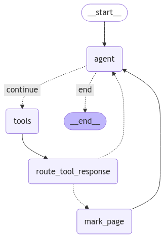

# Web Browsing Agent with Langgraph 2025

## Description
Browser Agent is a project designed to monitor and interact with web browsers programmatically. It provides tools to automate browser tasks, collect data, and perform various web interactions. It only provides basic functionality to enable developers get started with browser agent. It uses latest langgraph concepts to enable the features. 

## Installation
To install the Browser Agent, clone the repository and install the dependencies:
add the required files in .env.example and then remove the '.example' from the end.

```bash
git clone https://github.com/zaffau/browser_agent.git
cd browser_agent
pip install -r requirements.txt
```

## Usage
To use the Browser Agent, run the following command:

```bash
python agent.py
```

You will be prompted to enter a query. The agent will then interact with the browser based on the provided query.

## Graph
The workflow graph is generated and saved as `static/graph.png`.



## License
This project is licensed under the MIT License. See the [LICENSE](LICENSE) file for details.
