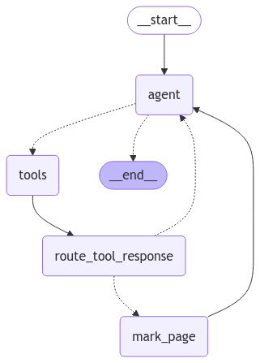

# Browser Agent

## Description
Browser Agent is a project designed to monitor and interact with web browsers programmatically. It provides tools to automate browser tasks, collect data, and perform various web interactions.

## Installation
To install the Browser Agent, clone the repository and install the dependencies:

```bash
git clone https://github.com/zaffau/browser_agent.git
cd browser_agent
pip install -r requirements.txt
```

## Usage
To use the Browser Agent, run the following command:

```bash
python agent.py
```

You will be prompted to enter a query. The agent will then interact with the browser based on the provided query.

## Graph
The workflow graph is generated and saved as `static/graph.png`.



## License
This project is licensed under the MIT License. See the [LICENSE](LICENSE) file for details.
